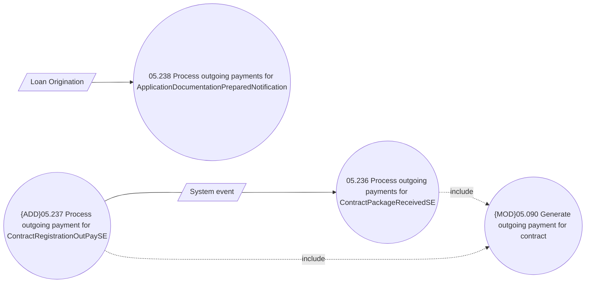

# Process internal system events and notifications for outgoing payments

- **Diagram Type**: Use Case
- **Package**: HomerSelect/BSL/Analysis Model/Payments/Outgoing payments/Process internal system events and notifications for outgoing payments/UseCase model
- **Diagram ID**: 144263
- **Elements**: 6
- **Connectors**: 5

