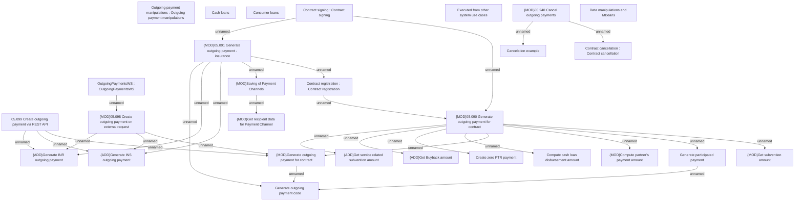

# Generate and Cancel outgoing payments

```mermaid
graph TD
    Create_zero_PTR_payment["Create zero PTR payment"]
    n_05_099_Create_outgoing_payment_via_REST_API["05.099 Create outgoing payment via REST API"]
    Outgoing_payment_manipulations_Outgoing_payment_manipulation["Outgoing payment manipulations : Outgoing payment manipulations"]
    ADD_Get_service_related_subvention_amount["{ADD}Get service related subvention amount"]
    ADD_Generate_INR_outgoing_payment["{ADD}Generate INR outgoing payment"]
    ADD_Generate_INS_outgoing_payment["{ADD}Generate INS outgoing payment "]
    OutgoingPaymentsWS_OutgoingPaymentsWS["OutgoingPaymentsWS : OutgoingPaymentsWS"]
    MOD_05_098_Create_outgoing_payment_on_external_request["{MOD}05.098 Create outgoing payment on external request"]
    ADD_Get_Buyback_amount["{ADD}Get Buyback amount"]
    MOD_Get_recipient_data_for_Payment_Channel["{MOD}Get recipient data for Payment Channel"]
    MOD_Saving_of_Payment_Channels["{MOD}Saving of Payment Channels"]
    Generate_outgoing_payment_code["Generate outgoing payment code"]
    MOD_05_091_Generate_outgoing_payment_insurance["{MOD}05.091 Generate outgoing payment - insurance"]
    Cash_loans["Cash loans"]
    Compute_cash_loan_disbursement_amount["Compute cash loan disbursement amount"]
    Consumer_loans["Consumer loans"]
    MOD_Generate_outgoing_payment_for_contract["{MOD}Generate outgoing payment for contract"]
    Contract_cancellation_Contract_cancellation["Contract cancellation : Contract cancellation"]
    Contract_signing_Contract_signing["Contract signing : Contract signing"]
    Contract_registration_Contract_registration["Contract registration : Contract registration"]
    MOD_Compute_partner_s_payment_amount["{MOD}Compute partner’s payment amount"]
    Generate_participated_payment["Generate participated payment"]
    MOD_Get_subvention_amount["{MOD}Get subvention amount"]
    MOD_05_090_Generate_outgoing_payment_for_contract["{MOD}05.090 Generate outgoing payment for contract"]
    Executed_from_other_system_use_cases["Executed from other system use cases"]
    Cancelation_example["Cancelation example"]
    MOD_05_240_Cancel_outgoing_payments["{MOD}05.240 Cancel outgoing payments"]
    Data_manipulations_and_MBeans["Data manipulations and MBeans"]
    MOD_05_091_Generate_outgoing_payment_insurance -->|unnamed| Generate_outgoing_payment_code
    MOD_05_090_Generate_outgoing_payment_for_contract -->|unnamed| ADD_Get_service_related_subvention_amount
    MOD_05_098_Create_outgoing_payment_on_external_request -->|unnamed| ADD_Generate_INR_outgoing_payment
    n_05_099_Create_outgoing_payment_via_REST_API -->|unnamed| ADD_Generate_INR_outgoing_payment
    MOD_05_091_Generate_outgoing_payment_insurance -->|unnamed| ADD_Generate_INR_outgoing_payment
    n_05_099_Create_outgoing_payment_via_REST_API -->|unnamed| ADD_Generate_INS_outgoing_payment
    MOD_05_091_Generate_outgoing_payment_insurance -->|unnamed| ADD_Generate_INS_outgoing_payment
    MOD_05_098_Create_outgoing_payment_on_external_request -->|unnamed| ADD_Generate_INS_outgoing_payment
    OutgoingPaymentsWS_OutgoingPaymentsWS -->|unnamed| MOD_05_098_Create_outgoing_payment_on_external_request
    MOD_05_090_Generate_outgoing_payment_for_contract -->|unnamed| ADD_Get_Buyback_amount
    MOD_Saving_of_Payment_Channels -->|unnamed| MOD_Get_recipient_data_for_Payment_Channel
    MOD_05_091_Generate_outgoing_payment_insurance -->|unnamed| MOD_Saving_of_Payment_Channels
    MOD_05_090_Generate_outgoing_payment_for_contract -->|unnamed| Create_zero_PTR_payment
    Generate_participated_payment -->|unnamed| Generate_outgoing_payment_code
    MOD_05_240_Cancel_outgoing_payments -->|unnamed| Cancelation_example
    Contract_signing_Contract_signing -->|unnamed| MOD_05_091_Generate_outgoing_payment_insurance
    MOD_05_090_Generate_outgoing_payment_for_contract -->|unnamed| Compute_cash_loan_disbursement_amount
    MOD_05_098_Create_outgoing_payment_on_external_request -->|unnamed| MOD_Generate_outgoing_payment_for_contract
    MOD_05_090_Generate_outgoing_payment_for_contract -->|unnamed| MOD_Generate_outgoing_payment_for_contract
    n_05_099_Create_outgoing_payment_via_REST_API -->|unnamed| MOD_Generate_outgoing_payment_for_contract
    MOD_05_240_Cancel_outgoing_payments -->|unnamed| Contract_cancellation_Contract_cancellation
    MOD_05_091_Generate_outgoing_payment_insurance -->|unnamed| Contract_registration_Contract_registration
    MOD_05_090_Generate_outgoing_payment_for_contract -->|unnamed| MOD_Compute_partner_s_payment_amount
    MOD_05_090_Generate_outgoing_payment_for_contract -->|unnamed| Generate_participated_payment
    MOD_05_090_Generate_outgoing_payment_for_contract -->|unnamed| MOD_Get_subvention_amount
    Contract_signing_Contract_signing -->|unnamed| MOD_05_090_Generate_outgoing_payment_for_contract
    Contract_registration_Contract_registration -->|unnamed| MOD_05_090_Generate_outgoing_payment_for_contract
    MOD_Generate_outgoing_payment_for_contract -->|unnamed| Generate_outgoing_payment_code
```
