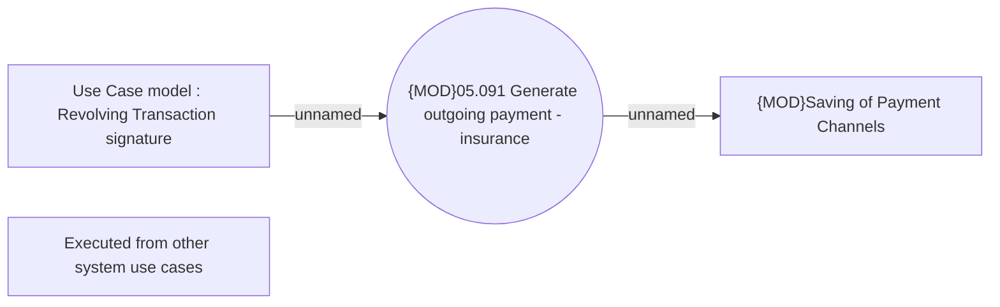

# Generate outgoing payments for revolving transaction

- **Diagram Type**: Use Case
- **Package**: HomerSelect/BSL/Analysis Model/Payments/Outgoing payments/Process outgoing payments/Use Case Model
- **Diagram ID**: 164610
- **Elements**: 4
- **Connectors**: 2

