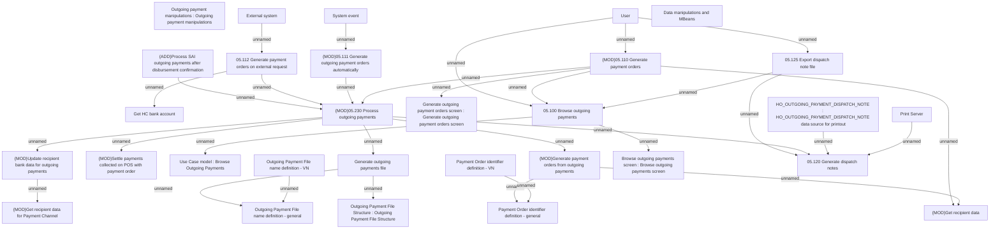

# Process outgoing payments

```mermaid
graph TD
    ADD_Process_SAI_outgoing_payments_after_disbursement_confirm["{ADD}Process SAI outgoing payments after disbursement confirmation"]
    Outgoing_payment_manipulations_Outgoing_payment_manipulation["Outgoing payment manipulations : Outgoing payment manipulations"]
    Get_HC_bank_account["Get HC bank account"]
    External_system["External system"]
    n_05_112_Generate_payment_orders_on_external_request["05.112 Generate payment orders on external request"]
    MOD_Get_recipient_data_for_Payment_Channel["{MOD}Get recipient data for Payment Channel"]
    MOD_Update_recipient_bank_data_for_outgoing_payments["{MOD}Update recipient bank data for outgoing payments"]
    System_event["System event"]
    MOD_Settle_payments_collected_on_POS_with_payment_order["{MOD}Settle payments collected on POS with payment order"]
    MOD_05_111_Generate_outgoing_payment_orders_automatically["{MOD}05.111 Generate outgoing payment orders automatically"]
    Use_Case_model_Browse_Outgoing_Payments["Use Case model : Browse Outgoing Payments"]
    HO_OUTGOING_PAYMENT_DISPATCH_NOTE_HO_OUTGOING_PAYMENT_DISPAT["HO_OUTGOING_PAYMENT_DISPATCH_NOTE : HO_OUTGOING_PAYMENT_DISPATCH_NOTE data source for printout"]
    Payment_Order_identifier_definition_VN["Payment Order identifier definition - VN"]
    Payment_Order_identifier_definition_general["Payment Order identifier definition - general"]
    Outgoing_Payment_File_name_definition_general["Outgoing Payment File name definition - general"]
    Outgoing_Payment_File_name_definition_VN["Outgoing Payment File name definition - VN"]
    Outgoing_Payment_File_Structure_Outgoing_Payment_File_Struct["Outgoing Payment File Structure : Outgoing Payment File Structure"]
    Generate_outgoing_payments_file["Generate outgoing payments file"]
    MOD_Generate_payment_orders_from_outgoing_payments["{MOD}Generate payment orders from outgoing payments"]
    MOD_Get_recipient_data["{MOD}Get recipient data"]
    Generate_outgoing_payment_orders_screen_Generate_outgoing_pa["Generate outgoing payment orders screen : Generate outgoing payment orders screen"]
    n_05_125_Export_dispatch_note_file["05.125 Export dispatch note file"]
    Browse_outgoing_payments_screen_Browse_outgoing_payments_scr["Browse outgoing payments screen : Browse outgoing payments screen"]
    MOD_05_110_Generate_payment_orders["{MOD}05.110 Generate payment orders"]
    User["User"]
    n_05_120_Generate_dispatch_notes["05.120 Generate dispatch notes"]
    MOD_05_230_Process_outgoing_payments["{MOD}05.230 Process outgoing payments"]
    Print_Server["Print Server"]
    n_05_100_Browse_outgoing_payments["05.100 Browse outgoing payments"]
    Data_manipulations_and_MBeans["Data manipulations and MBeans"]
    MOD_05_110_Generate_payment_orders -->|unnamed| Generate_outgoing_payment_orders_screen_Generate_outgoing_pa
    External_system -->|unnamed| n_05_112_Generate_payment_orders_on_external_request
    MOD_Update_recipient_bank_data_for_outgoing_payments -->|unnamed| MOD_Get_recipient_data_for_Payment_Channel
    MOD_05_230_Process_outgoing_payments -->|unnamed| MOD_Update_recipient_bank_data_for_outgoing_payments
    MOD_05_230_Process_outgoing_payments -->|unnamed| MOD_Settle_payments_collected_on_POS_with_payment_order
    System_event -->|unnamed| MOD_05_111_Generate_outgoing_payment_orders_automatically
    n_05_100_Browse_outgoing_payments -->|unnamed| Use_Case_model_Browse_Outgoing_Payments
    MOD_Generate_payment_orders_from_outgoing_payments -->|unnamed| Payment_Order_identifier_definition_general
    Payment_Order_identifier_definition_VN -->|unnamed| Payment_Order_identifier_definition_general
    Generate_outgoing_payments_file -->|unnamed| Outgoing_Payment_File_name_definition_general
    Outgoing_Payment_File_name_definition_VN -->|unnamed| Outgoing_Payment_File_name_definition_general
    Generate_outgoing_payments_file -->|unnamed| Outgoing_Payment_File_Structure_Outgoing_Payment_File_Struct
    MOD_05_230_Process_outgoing_payments -->|unnamed| Generate_outgoing_payments_file
    MOD_05_230_Process_outgoing_payments -->|unnamed| MOD_Generate_payment_orders_from_outgoing_payments
    n_05_112_Generate_payment_orders_on_external_request -->|unnamed| Get_HC_bank_account
    n_05_125_Export_dispatch_note_file -->|unnamed| n_05_120_Generate_dispatch_notes
    User -->|unnamed| n_05_100_Browse_outgoing_payments
    MOD_05_110_Generate_payment_orders -->|unnamed| n_05_100_Browse_outgoing_payments
    ADD_Process_SAI_outgoing_payments_after_disbursement_confirm -->|unnamed| MOD_05_230_Process_outgoing_payments
    n_05_112_Generate_payment_orders_on_external_request -->|unnamed| MOD_05_230_Process_outgoing_payments
    MOD_05_111_Generate_outgoing_payment_orders_automatically -->|unnamed| MOD_05_230_Process_outgoing_payments
    MOD_05_110_Generate_payment_orders -->|unnamed| MOD_Get_recipient_data
    MOD_05_230_Process_outgoing_payments -->|unnamed| n_05_120_Generate_dispatch_notes
    MOD_Generate_payment_orders_from_outgoing_payments -->|unnamed| MOD_Get_recipient_data
    HO_OUTGOING_PAYMENT_DISPATCH_NOTE_HO_OUTGOING_PAYMENT_DISPAT -->|unnamed| n_05_120_Generate_dispatch_notes
    Print_Server -->|unnamed| n_05_120_Generate_dispatch_notes
    User -->|unnamed| MOD_05_110_Generate_payment_orders
    n_05_100_Browse_outgoing_payments -->|unnamed| Browse_outgoing_payments_screen_Browse_outgoing_payments_scr
    User -->|unnamed| n_05_125_Export_dispatch_note_file
    n_05_125_Export_dispatch_note_file -->|unnamed| n_05_100_Browse_outgoing_payments
    MOD_05_110_Generate_payment_orders -->|unnamed| MOD_05_230_Process_outgoing_payments
```
