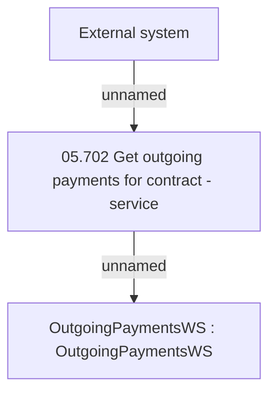

# Get outgoing payments for contract - service

```mermaid
graph TD
    OutgoingPaymentsWS_OutgoingPaymentsWS["OutgoingPaymentsWS : OutgoingPaymentsWS"]
    External_system["External system"]
    n_05_702_Get_outgoing_payments_for_contract_service["05.702 Get outgoing payments for contract - service"]
    n_05_702_Get_outgoing_payments_for_contract_service -->|unnamed| OutgoingPaymentsWS_OutgoingPaymentsWS
    External_system -->|unnamed| n_05_702_Get_outgoing_payments_for_contract_service
```
