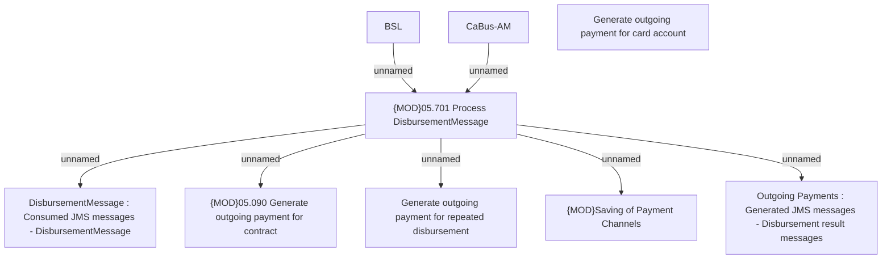

# Process DisbursementMessage

```mermaid
graph TD
    Outgoing_Payments_Generated_JMS_messages_Disbursement_result["Outgoing Payments : Generated JMS messages - Disbursement result messages"]
    MOD_Saving_of_Payment_Channels["{MOD}Saving of Payment Channels"]
    Generate_outgoing_payment_for_repeated_disbursement["Generate outgoing payment for repeated disbursement"]
    MOD_05_090_Generate_outgoing_payment_for_contract["{MOD}05.090 Generate outgoing payment for contract"]
    DisbursementMessage_Consumed_JMS_messages_DisbursementMessag["DisbursementMessage : Consumed JMS messages - DisbursementMessage"]
    CaBus_AM["CaBus-AM"]
    BSL["BSL"]
    MOD_05_701_Process_DisbursementMessage["{MOD}05.701 Process DisbursementMessage"]
    Generate_outgoing_payment_for_card_account["Generate outgoing payment for card account"]
    MOD_05_701_Process_DisbursementMessage -->|unnamed| DisbursementMessage_Consumed_JMS_messages_DisbursementMessag
    MOD_05_701_Process_DisbursementMessage -->|unnamed| MOD_05_090_Generate_outgoing_payment_for_contract
    MOD_05_701_Process_DisbursementMessage -->|unnamed| Generate_outgoing_payment_for_repeated_disbursement
    MOD_05_701_Process_DisbursementMessage -->|unnamed| MOD_Saving_of_Payment_Channels
    MOD_05_701_Process_DisbursementMessage -->|unnamed| Outgoing_Payments_Generated_JMS_messages_Disbursement_result
    BSL -->|unnamed| MOD_05_701_Process_DisbursementMessage
    CaBus_AM -->|unnamed| MOD_05_701_Process_DisbursementMessage
```
