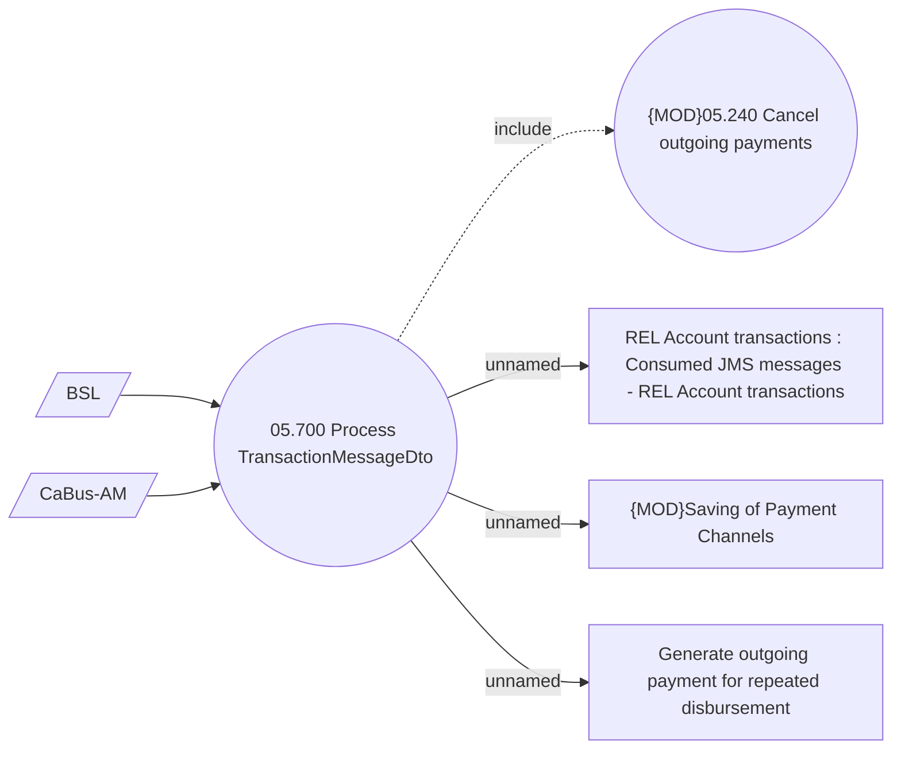

# Process TransactionMessageDto 

- **Diagram Type**: Use Case
- **Package**: HomerSelect/BSL/Analysis Model/Payments/Outgoing payments/Process requests for outgoing payments from external systems/Use case Model
- **Diagram ID**: 142888
- **Elements**: 7
- **Connectors**: 6

