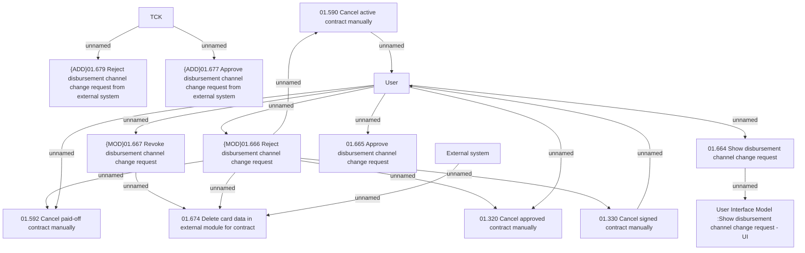

# Disbursement channel change request processing

```mermaid
graph TD
    TCK["TCK"]
    ADD_01_679_Reject_disbursement_channel_change_request_from_e["{ADD}01.679 Reject disbursement channel change request from external system "]
    ADD_01_677_Approve_disbursement_channel_change_request_from_["{ADD}01.677 Approve disbursement channel change request from external system"]
    External_system["External system"]
    n_01_674_Delete_card_data_in_external_module_for_contract["01.674 Delete card data in external module for contract"]
    n_01_592_Cancel_paid_off_contract_manually["01.592 Cancel paid-off contract manually"]
    n_01_590_Cancel_active_contract_manually["01.590 Cancel active contract manually"]
    n_01_330_Cancel_signed_contract_manually["01.330 Cancel signed contract manually"]
    n_01_320_Cancel_approved_contract_manually["01.320 Cancel approved contract manually"]
    MOD_01_667_Revoke_disbursement_channel_change_request["{MOD}01.667 Revoke disbursement channel change request"]
    MOD_01_666_Reject_disbursement_channel_change_request["{MOD}01.666 Reject disbursement channel change request"]
    n_01_665_Approve_disbursement_channel_change_request["01.665 Approve disbursement channel change request"]
    User_Interface_Model_Show_disbursement_channel_change_reques["User Interface Model :Show disbursement channel change request - UI"]
    User["User"]
    n_01_664_Show_disbursement_channel_change_request["01.664 Show disbursement channel change request"]
    MOD_01_666_Reject_disbursement_channel_change_request -->|unnamed| n_01_320_Cancel_approved_contract_manually
    MOD_01_667_Revoke_disbursement_channel_change_request -->|unnamed| n_01_674_Delete_card_data_in_external_module_for_contract
    MOD_01_666_Reject_disbursement_channel_change_request -->|unnamed| n_01_674_Delete_card_data_in_external_module_for_contract
    MOD_01_666_Reject_disbursement_channel_change_request -->|unnamed| n_01_592_Cancel_paid_off_contract_manually
    MOD_01_666_Reject_disbursement_channel_change_request -->|unnamed| n_01_330_Cancel_signed_contract_manually
    n_01_664_Show_disbursement_channel_change_request -->|unnamed| User_Interface_Model_Show_disbursement_channel_change_reques
    MOD_01_666_Reject_disbursement_channel_change_request -->|unnamed| n_01_590_Cancel_active_contract_manually
    External_system -->|unnamed| n_01_674_Delete_card_data_in_external_module_for_contract
    TCK -->|unnamed| ADD_01_677_Approve_disbursement_channel_change_request_from_
    TCK -->|unnamed| ADD_01_679_Reject_disbursement_channel_change_request_from_e
    User -->|unnamed| n_01_592_Cancel_paid_off_contract_manually
    User -->|unnamed| MOD_01_667_Revoke_disbursement_channel_change_request
    User -->|unnamed| MOD_01_666_Reject_disbursement_channel_change_request
    User -->|unnamed| n_01_664_Show_disbursement_channel_change_request
    User -->|unnamed| n_01_665_Approve_disbursement_channel_change_request
    User -->|unnamed| n_01_320_Cancel_approved_contract_manually
    n_01_330_Cancel_signed_contract_manually -->|unnamed| User
    n_01_590_Cancel_active_contract_manually -->|unnamed| User
```
