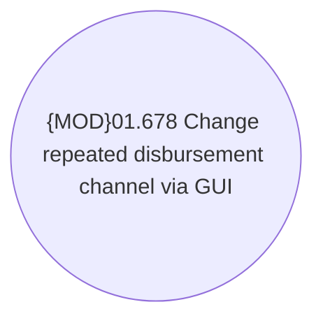

# Change repeated disbursement channel

- **Diagram Type**: Use Case
- **Package**: HomerSelect/BSL/Analysis Model/Payments/Payment Channels Management/Disbursements channel management/UseCase Model
- **Diagram ID**: 164547
- **Elements**: 1
- **Connectors**: 0

