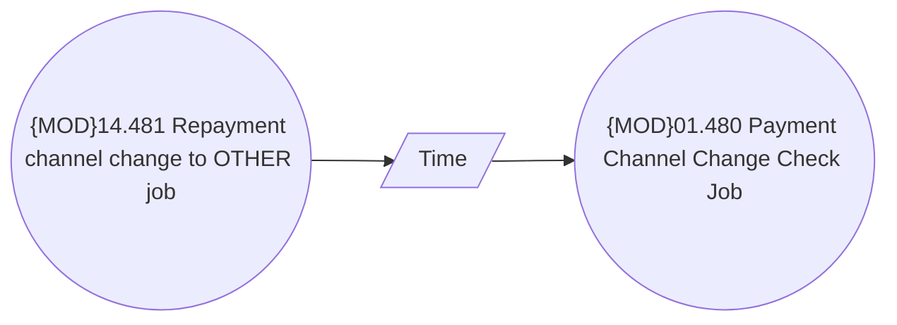

# Payment Channel Change Check Job

- **Diagram Type**: Use Case
- **Package**: HomerSelect/BSL/Analysis Model/Payments/Payment Channels Management/Payment Channel Change Check Job/UseCase Model
- **Diagram ID**: 134489
- **Elements**: 3
- **Connectors**: 2

