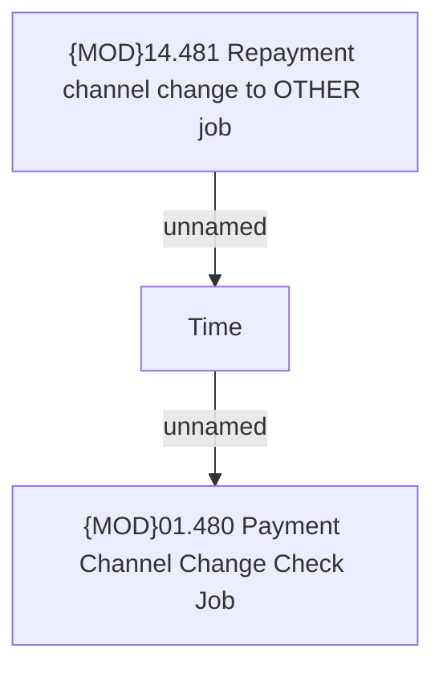

# Payment Channel Change Check Job

```mermaid
graph TD
    MOD_14_481_Repayment_channel_change_to_OTHER_job["{MOD}14.481 Repayment channel change to OTHER job"]
    MOD_01_480_Payment_Channel_Change_Check_Job["{MOD}01.480 Payment Channel Change Check Job"]
    Time["Time"]
    MOD_14_481_Repayment_channel_change_to_OTHER_job -->|unnamed| Time
    Time -->|unnamed| MOD_01_480_Payment_Channel_Change_Check_Job
```
