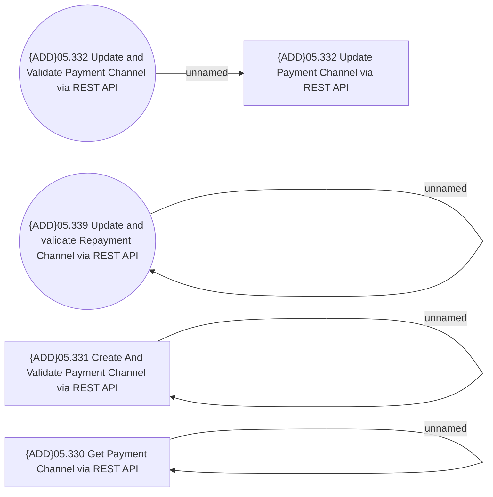

# Access Rights

- **Diagram Type**: Use Case
- **Package**: HomerSelect/BSL/Analysis Model/Payments/Payment Channels Management/Payment Channels via REST API/Access Rights
- **Diagram ID**: 152660
- **Elements**: 8
- **Connectors**: 4

