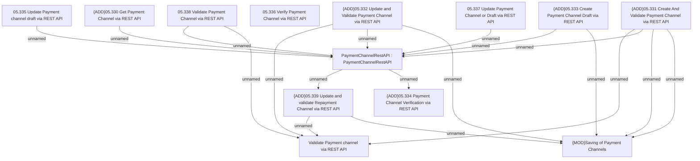

# Payment Channel via REST WS

```mermaid
graph TD
    ADD_05_339_Update_and_validate_Repayment_Channel_via_REST_AP["{ADD}05.339 Update and validate Repayment Channel via REST API"]
    Validate_Payment_channel_via_REST_API["Validate Payment channel via REST API"]
    n_05_338_Validate_Payment_Channel_via_REST_API["05.338 Validate Payment Channel via REST API"]
    n_05_337_Update_Payment_Channel_or_Draft_via_REST_API["05.337 Update Payment Channel or Draft via REST API"]
    n_05_335_Update_Payment_channel_draft_via_REST_API["05.335 Update Payment channel draft via REST API"]
    n_05_336_Verify_Payment_Channel_via_REST_API["05.336 Verify Payment Channel via REST API"]
    ADD_05_333_Create_Payment_Channel_Draft_via_REST_API["{ADD}05.333 Create Payment Channel Draft via REST API"]
    PaymentChannelRestAPI_PaymentChannelRestAPI["PaymentChannelRestAPI : PaymentChannelRestAPI"]
    MOD_Saving_of_Payment_Channels["{MOD}Saving of Payment Channels"]
    ADD_05_332_Update_and_Validate_Payment_Channel_via_REST_API["{ADD}05.332 Update and Validate Payment Channel via REST API"]
    ADD_05_331_Create_And_Validate_Payment_Channel_via_REST_API["{ADD}05.331 Create And Validate Payment Channel via REST API"]
    ADD_05_334_Payment_Channel_Verification_via_REST_API["{ADD}05.334 Payment Channel Verification via REST API"]
    ADD_05_330_Get_Payment_Channel_via_REST_API["{ADD}05.330 Get Payment Channel via REST API"]
    n_05_338_Validate_Payment_Channel_via_REST_API -->|unnamed| PaymentChannelRestAPI_PaymentChannelRestAPI
    ADD_05_339_Update_and_validate_Repayment_Channel_via_REST_AP -->|unnamed| Validate_Payment_channel_via_REST_API
    ADD_05_332_Update_and_Validate_Payment_Channel_via_REST_API -->|unnamed| Validate_Payment_channel_via_REST_API
    ADD_05_331_Create_And_Validate_Payment_Channel_via_REST_API -->|unnamed| Validate_Payment_channel_via_REST_API
    n_05_338_Validate_Payment_Channel_via_REST_API -->|unnamed| Validate_Payment_channel_via_REST_API
    ADD_05_333_Create_Payment_Channel_Draft_via_REST_API -->|unnamed| PaymentChannelRestAPI_PaymentChannelRestAPI
    n_05_335_Update_Payment_channel_draft_via_REST_API -->|unnamed| PaymentChannelRestAPI_PaymentChannelRestAPI
    PaymentChannelRestAPI_PaymentChannelRestAPI -->|unnamed| ADD_05_339_Update_and_validate_Repayment_Channel_via_REST_AP
    ADD_05_330_Get_Payment_Channel_via_REST_API -->|unnamed| PaymentChannelRestAPI_PaymentChannelRestAPI
    PaymentChannelRestAPI_PaymentChannelRestAPI -->|unnamed| ADD_05_334_Payment_Channel_Verification_via_REST_API
    ADD_05_332_Update_and_Validate_Payment_Channel_via_REST_API -->|unnamed| PaymentChannelRestAPI_PaymentChannelRestAPI
    ADD_05_331_Create_And_Validate_Payment_Channel_via_REST_API -->|unnamed| PaymentChannelRestAPI_PaymentChannelRestAPI
    ADD_05_331_Create_And_Validate_Payment_Channel_via_REST_API -->|unnamed| MOD_Saving_of_Payment_Channels
    ADD_05_332_Update_and_Validate_Payment_Channel_via_REST_API -->|unnamed| MOD_Saving_of_Payment_Channels
    ADD_05_339_Update_and_validate_Repayment_Channel_via_REST_AP -->|unnamed| MOD_Saving_of_Payment_Channels
    ADD_05_331_Create_And_Validate_Payment_Channel_via_REST_API -->|unnamed| MOD_Saving_of_Payment_Channels
    ADD_05_333_Create_Payment_Channel_Draft_via_REST_API -->|unnamed| MOD_Saving_of_Payment_Channels
    n_05_337_Update_Payment_Channel_or_Draft_via_REST_API -->|unnamed| PaymentChannelRestAPI_PaymentChannelRestAPI
```
