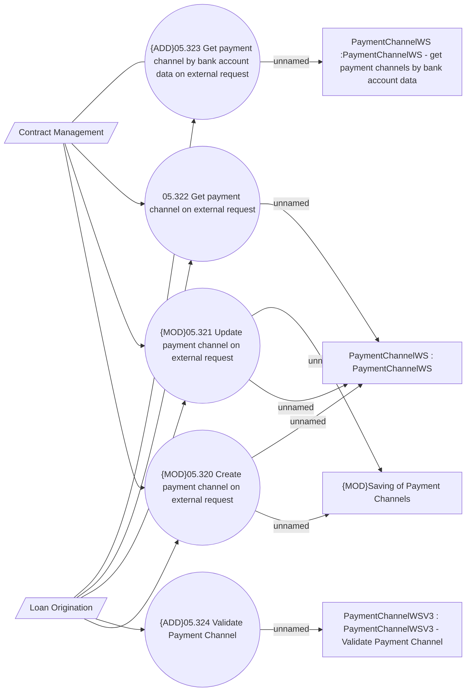

# Payment Channels via WS

- **Diagram Type**: Use Case
- **Package**: HomerSelect/BSL/Analysis Model/Payments/Payment Channels Management/Payment Channels via WS/Use Case Model
- **Diagram ID**: 148774
- **Elements**: 11
- **Connectors**: 16

