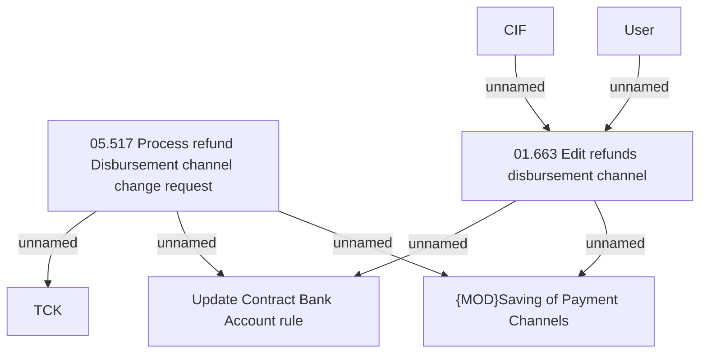

# Change refunds disbursement channel

```mermaid
graph TD
    TCK["TCK"]
    n_05_517_Process_refund_Disbursement_channel_change_request["05.517 Process refund Disbursement channel change request"]
    Update_Contract_Bank_Account_rule["Update Contract Bank Account rule"]
    MOD_Saving_of_Payment_Channels["{MOD}Saving of Payment Channels"]
    CIF["CIF"]
    User["User"]
    n_01_663_Edit_refunds_disbursement_channel["01.663 Edit refunds disbursement channel"]
    n_05_517_Process_refund_Disbursement_channel_change_request -->|unnamed| MOD_Saving_of_Payment_Channels
    n_01_663_Edit_refunds_disbursement_channel -->|unnamed| MOD_Saving_of_Payment_Channels
    n_01_663_Edit_refunds_disbursement_channel -->|unnamed| Update_Contract_Bank_Account_rule
    n_05_517_Process_refund_Disbursement_channel_change_request -->|unnamed| Update_Contract_Bank_Account_rule
    n_05_517_Process_refund_Disbursement_channel_change_request -->|unnamed| TCK
    User -->|unnamed| n_01_663_Edit_refunds_disbursement_channel
    CIF -->|unnamed| n_01_663_Edit_refunds_disbursement_channel
```
