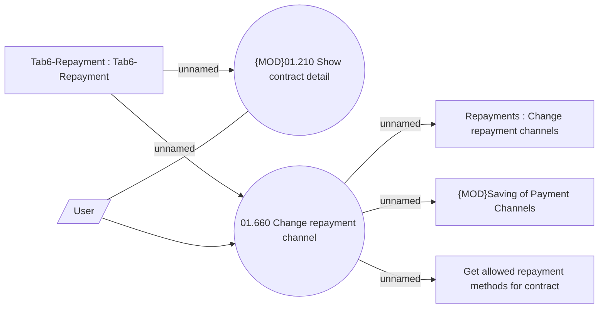

# Change repayment channel

- **Diagram Type**: Use Case
- **Package**: HomerSelect/BSL/Analysis Model/Payments/Payment Channels Management/Repayments channel management/Use Case Model
- **Diagram ID**: 143137
- **Elements**: 7
- **Connectors**: 7

