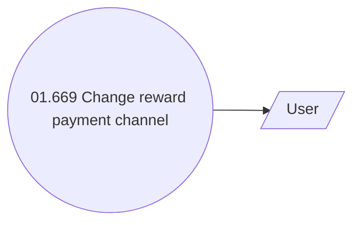

# Rewards payment channel management

- **Diagram Type**: Use Case
- **Package**: HomerSelect/BSL/Analysis Model/Payments/Payment Channels Management/Rewards payment channel management/Use Case Model
- **Diagram ID**: 159114
- **Elements**: 2
- **Connectors**: 1

