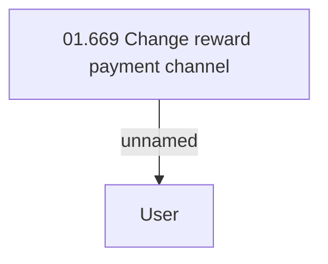

# Rewards payment channel management

```mermaid
graph TD
    User["User"]
    n_01_669_Change_reward_payment_channel["01.669 Change reward payment channel"]
    n_01_669_Change_reward_payment_channel -->|unnamed| User
```
