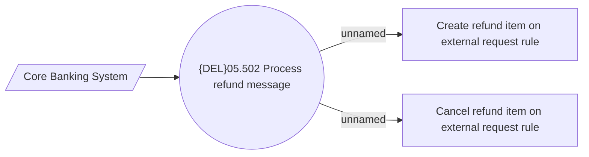

# Process refund message

- **Diagram Type**: Use Case
- **Package**: HomerSelect/BSL/Analysis Model/Payments/Refunds/Process refund message/Use Case
- **Diagram ID**: 164239
- **Elements**: 4
- **Connectors**: 3

