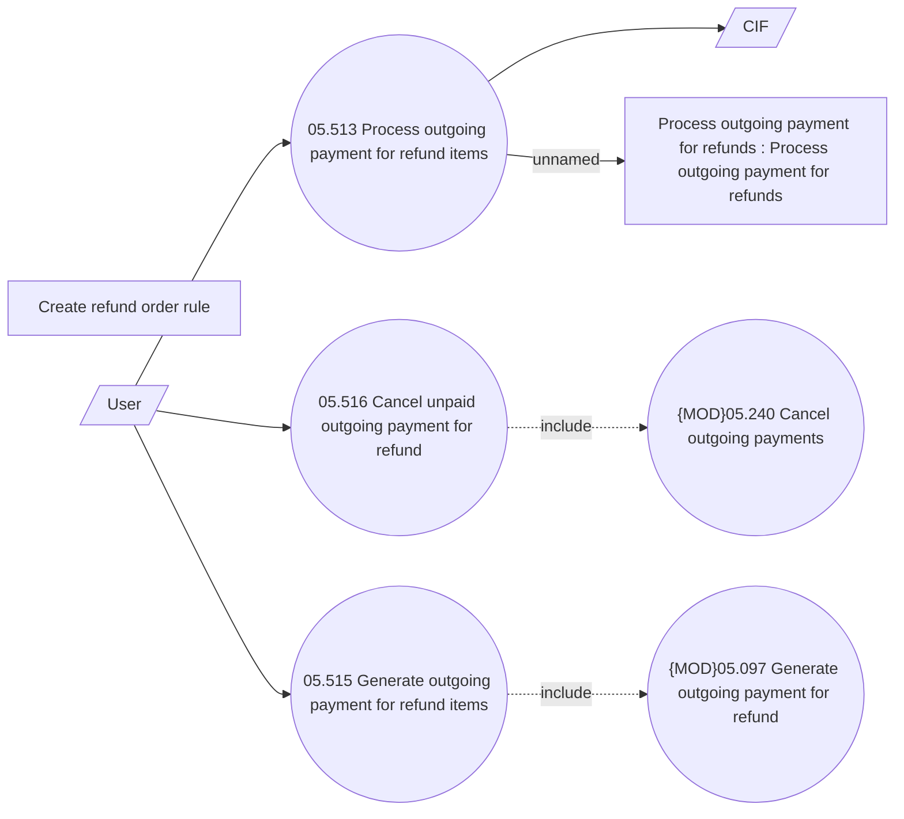

# Processing outgoing payments for refunds

- **Diagram Type**: Use Case
- **Package**: HomerSelect/BSL/Analysis Model/Payments/Refunds/Refund management/Use Case Model
- **Diagram ID**: 164242
- **Elements**: 9
- **Connectors**: 7

