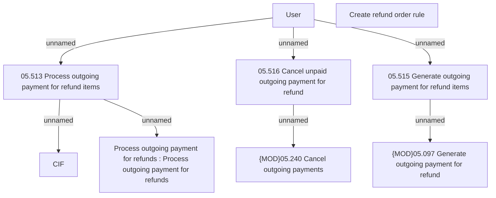

# Processing outgoing payments for refunds

```mermaid
graph TD
    Process_outgoing_payment_for_refunds_Process_outgoing_paymen["Process outgoing payment for refunds : Process outgoing payment for refunds"]
    CIF["CIF"]
    n_05_513_Process_outgoing_payment_for_refund_items["05.513 Process outgoing payment for refund items"]
    User["User"]
    MOD_05_097_Generate_outgoing_payment_for_refund["{MOD}05.097 Generate outgoing payment for refund"]
    MOD_05_240_Cancel_outgoing_payments["{MOD}05.240 Cancel outgoing payments"]
    n_05_516_Cancel_unpaid_outgoing_payment_for_refund["05.516 Cancel unpaid outgoing payment for refund"]
    n_05_515_Generate_outgoing_payment_for_refund_items["05.515 Generate outgoing payment for refund items"]
    Create_refund_order_rule["Create refund order rule"]
    n_05_516_Cancel_unpaid_outgoing_payment_for_refund -->|unnamed| MOD_05_240_Cancel_outgoing_payments
    n_05_515_Generate_outgoing_payment_for_refund_items -->|unnamed| MOD_05_097_Generate_outgoing_payment_for_refund
    n_05_513_Process_outgoing_payment_for_refund_items -->|unnamed| CIF
    n_05_513_Process_outgoing_payment_for_refund_items -->|unnamed| Process_outgoing_payment_for_refunds_Process_outgoing_paymen
    User -->|unnamed| n_05_513_Process_outgoing_payment_for_refund_items
    User -->|unnamed| n_05_516_Cancel_unpaid_outgoing_payment_for_refund
    User -->|unnamed| n_05_515_Generate_outgoing_payment_for_refund_items
```
