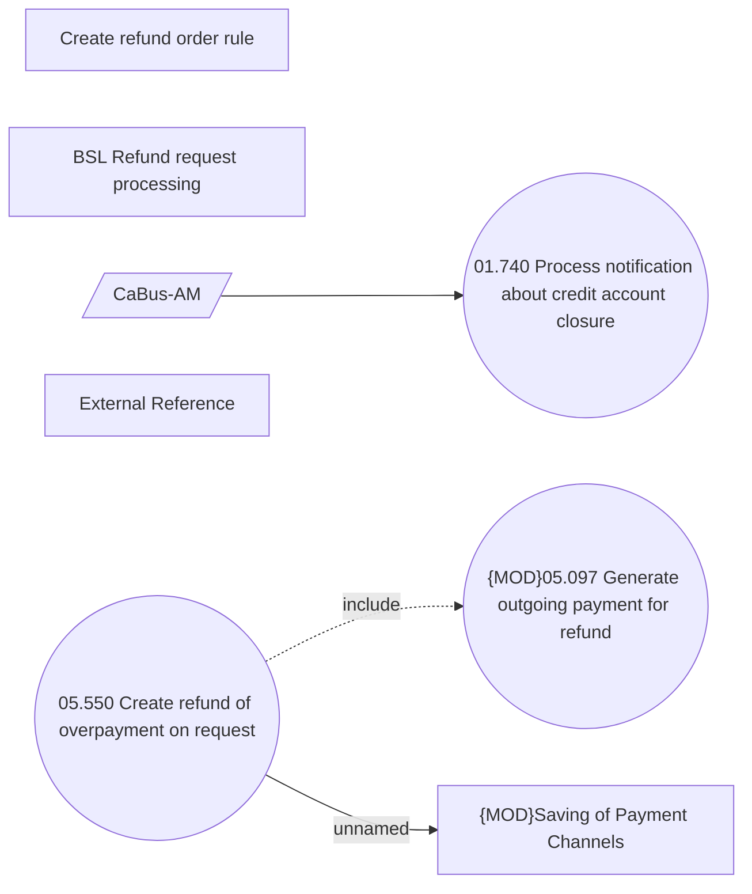

# REL Creating Refunds on request

- **Diagram Type**: Use Case
- **Package**: HomerSelect/BSL/Analysis Model/Payments/Refunds/Refund management/Use Case Model
- **Diagram ID**: 163356
- **Elements**: 8
- **Connectors**: 3

