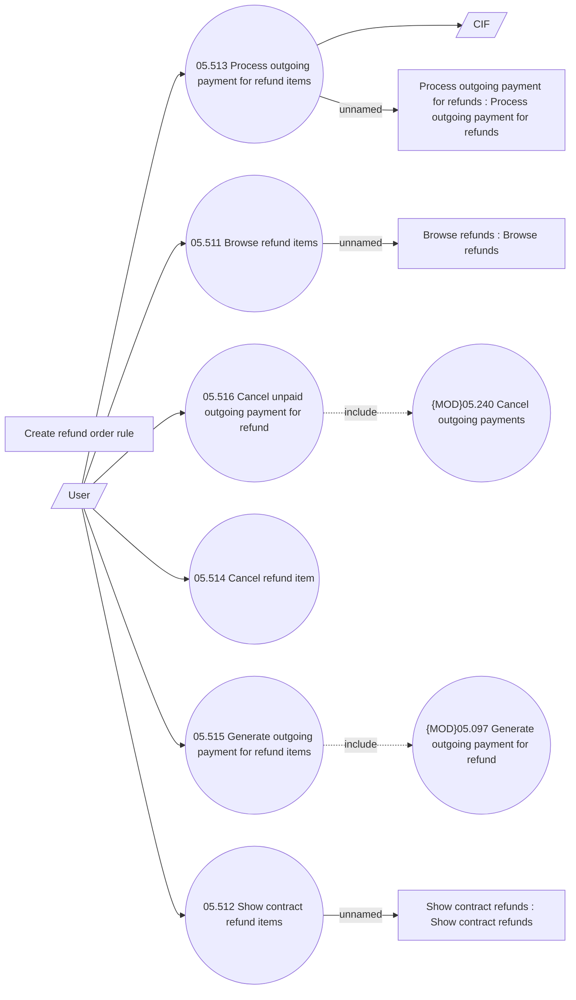

# Refunds management

- **Diagram Type**: Use Case
- **Package**: HomerSelect/BSL/Analysis Model/Payments/Refunds/Refund management/Use Case Model
- **Diagram ID**: 164241
- **Elements**: 14
- **Connectors**: 12

