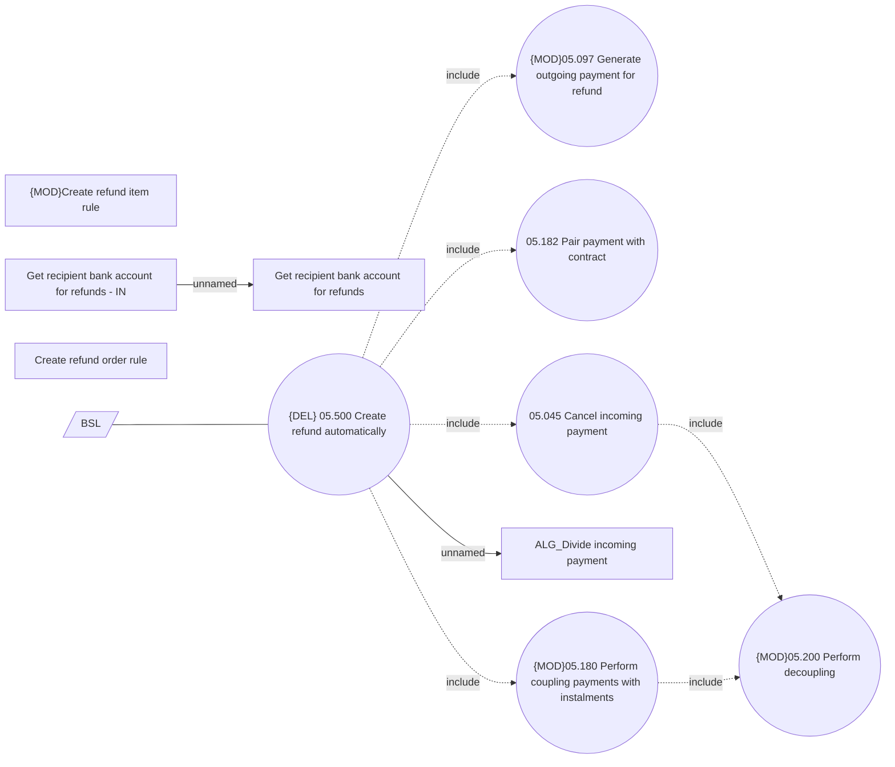

# {DEL}Creating Refunds automatically

- **Diagram Type**: Use Case
- **Package**: HomerSelect/BSL/Analysis Model/Payments/Refunds/Refund management/Use Case Model
- **Diagram ID**: 163354
- **Elements**: 12
- **Connectors**: 9

