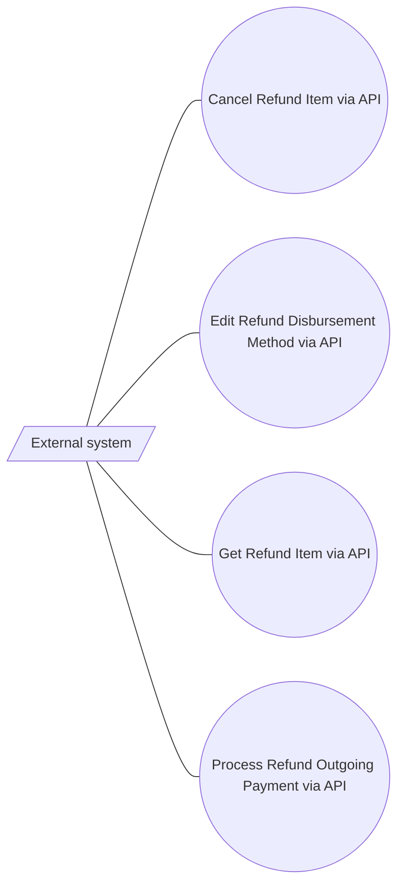

# Refund Service Rest API

- **Diagram Type**: Use Case
- **Package**: HomerSelect/BSL/Analysis Model/Payments/Refunds/Refund request processing/Use Case Model
- **Diagram ID**: 164248
- **Elements**: 5
- **Connectors**: 4

