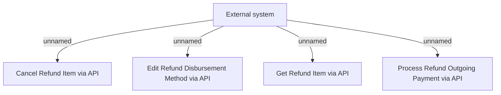

# Refund Service Rest API

```mermaid
graph TD
    External_system["External system"]
    Cancel_Refund_Item_via_API["Cancel Refund Item via API"]
    Get_Refund_Item_via_API["Get Refund Item via API"]
    Process_Refund_Outgoing_Payment_via_API["Process Refund Outgoing Payment via API"]
    Edit_Refund_Disbursement_Method_via_API["Edit Refund Disbursement Method via API"]
    External_system -->|unnamed| Cancel_Refund_Item_via_API
    External_system -->|unnamed| Edit_Refund_Disbursement_Method_via_API
    External_system -->|unnamed| Get_Refund_Item_via_API
    External_system -->|unnamed| Process_Refund_Outgoing_Payment_via_API
```
