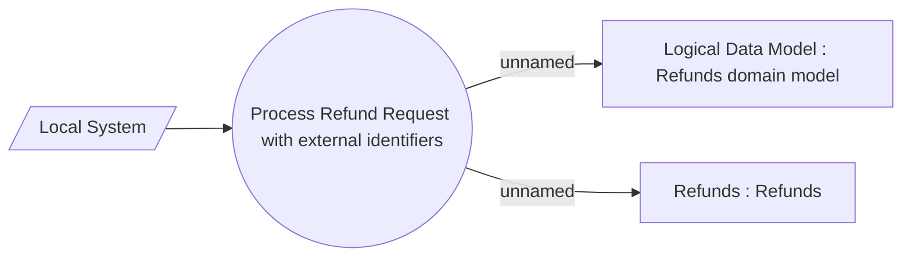

# Refund request processing

- **Diagram Type**: Use Case
- **Package**: HomerSelect/BSL/Analysis Model/Payments/Refunds/Refund request processing/Use Case Model
- **Diagram ID**: 164247
- **Elements**: 4
- **Connectors**: 3

