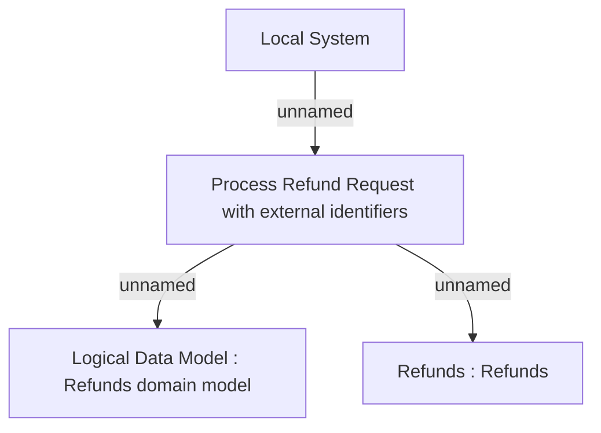

# Refund request processing

```mermaid
graph TD
    Refunds_Refunds["Refunds : Refunds"]
    Logical_Data_Model_Refunds_domain_model["Logical Data Model : Refunds domain model"]
    Local_System["Local System"]
    Process_Refund_Request_with_external_identifiers["Process Refund Request with external identifiers"]
    Local_System -->|unnamed| Process_Refund_Request_with_external_identifiers
    Process_Refund_Request_with_external_identifiers -->|unnamed| Logical_Data_Model_Refunds_domain_model
    Process_Refund_Request_with_external_identifiers -->|unnamed| Refunds_Refunds
```
