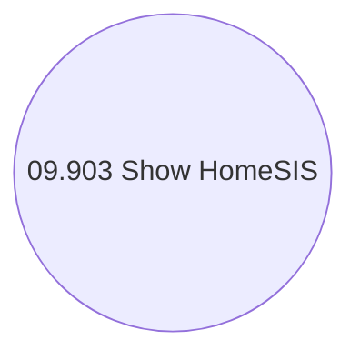

# Show HomeSIS application

- **Diagram Type**: Use Case
- **Package**: HomerSelect/BSL/Analysis Model/Sales Network Management/COMMON for Sales Network Management/Run HomeSIS application/Use Case
- **Diagram ID**: 71972
- **Elements**: 1
- **Connectors**: 0

