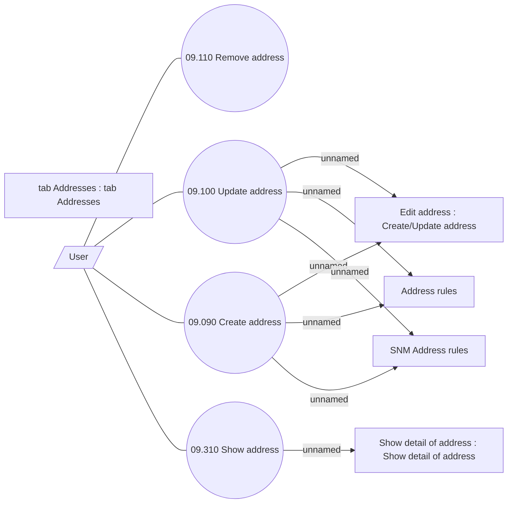

# Manage addresses

- **Diagram Type**: Use Case
- **Package**: HomerSelect/BSL/Analysis Model/Sales Network Management/COMMON for Sales Network Management/SN Address/Use Case
- **Diagram ID**: 71974
- **Elements**: 10
- **Connectors**: 11

