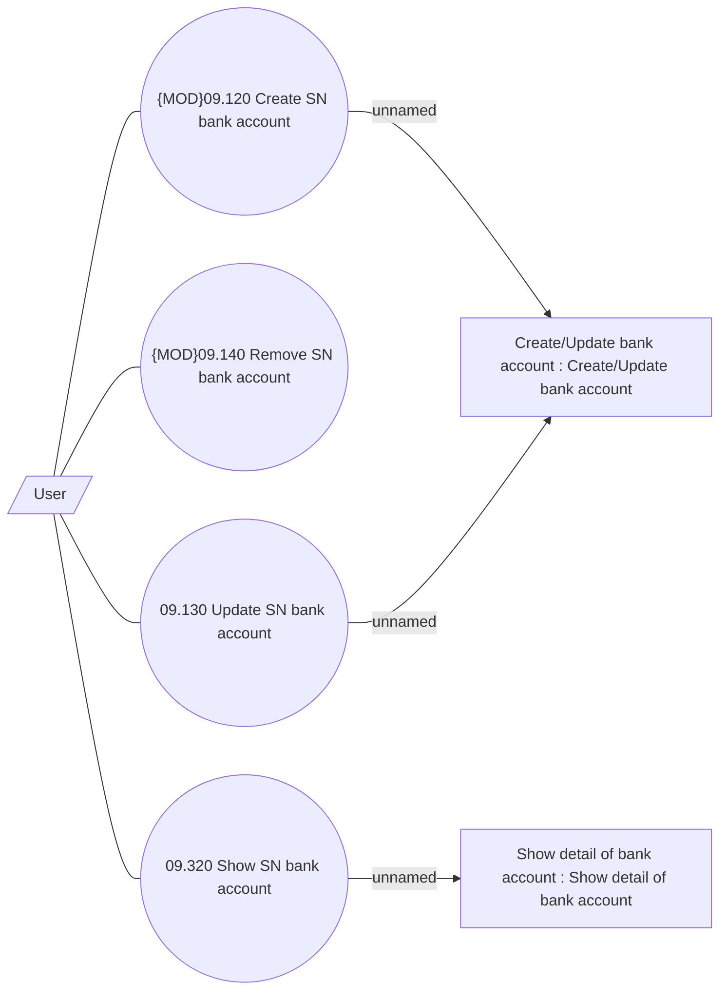

# Manage SN Bank Accounts

- **Diagram Type**: Use Case
- **Package**: HomerSelect/BSL/Analysis Model/Sales Network Management/COMMON for Sales Network Management/SN Bank Account/Use Case
- **Diagram ID**: 107516
- **Elements**: 7
- **Connectors**: 7

