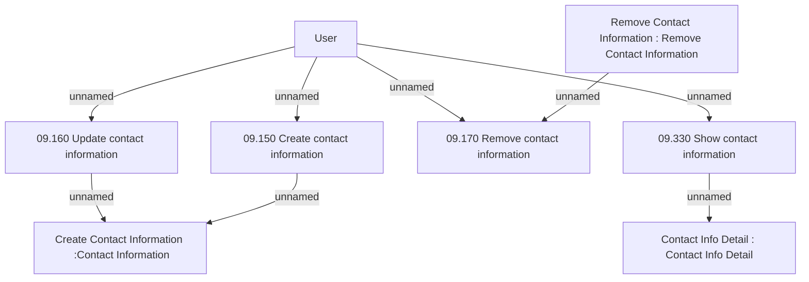

# Manage contact information

```mermaid
graph TD
    n_09_150_Create_contact_information["09.150 Create contact information"]
    Remove_Contact_Information_Remove_Contact_Information["Remove Contact Information : Remove Contact Information"]
    Create_Contact_Information_Contact_Information["Create Contact Information  :Contact Information"]
    Contact_Info_Detail_Contact_Info_Detail["Contact Info Detail : Contact Info Detail"]
    User["User"]
    n_09_330_Show_contact_information["09.330 Show contact information"]
    n_09_170_Remove_contact_information["09.170 Remove contact information"]
    n_09_160_Update_contact_information["09.160 Update contact information"]
    Remove_Contact_Information_Remove_Contact_Information -->|unnamed| n_09_170_Remove_contact_information
    n_09_330_Show_contact_information -->|unnamed| Contact_Info_Detail_Contact_Info_Detail
    n_09_150_Create_contact_information -->|unnamed| Create_Contact_Information_Contact_Information
    n_09_160_Update_contact_information -->|unnamed| Create_Contact_Information_Contact_Information
    User -->|unnamed| n_09_160_Update_contact_information
    User -->|unnamed| n_09_170_Remove_contact_information
    User -->|unnamed| n_09_330_Show_contact_information
    User -->|unnamed| n_09_150_Create_contact_information
```
