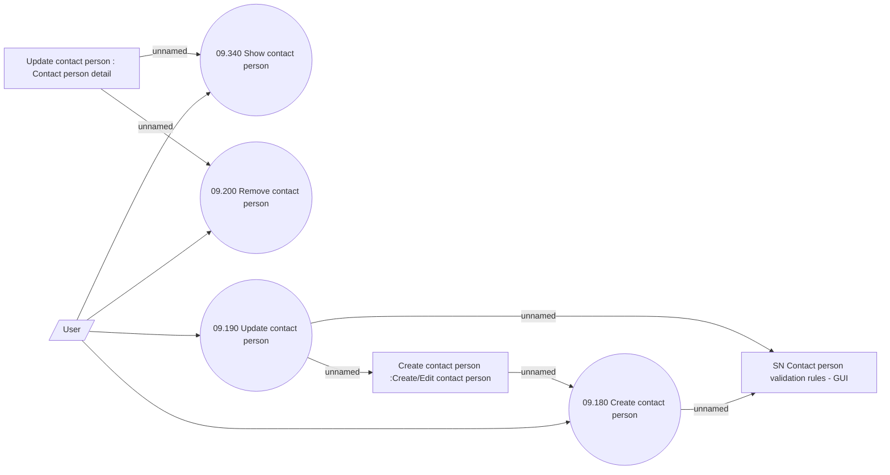

# Manage contact persons

- **Diagram Type**: Use Case
- **Package**: HomerSelect/BSL/Analysis Model/Sales Network Management/COMMON for Sales Network Management/SN Contact Person/Use Case
- **Diagram ID**: 71832
- **Elements**: 8
- **Connectors**: 10

