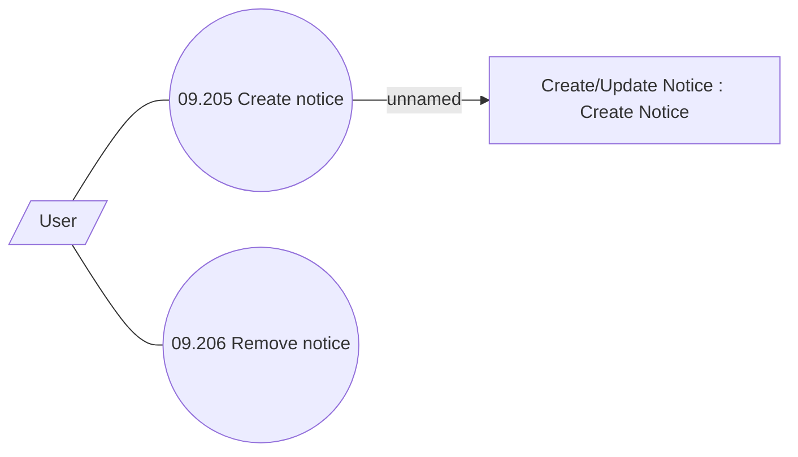

# Manage Notices

- **Diagram Type**: Use Case
- **Package**: HomerSelect/BSL/Analysis Model/Sales Network Management/COMMON for Sales Network Management/SN Notice/Use Case
- **Diagram ID**: 39199
- **Elements**: 4
- **Connectors**: 3

