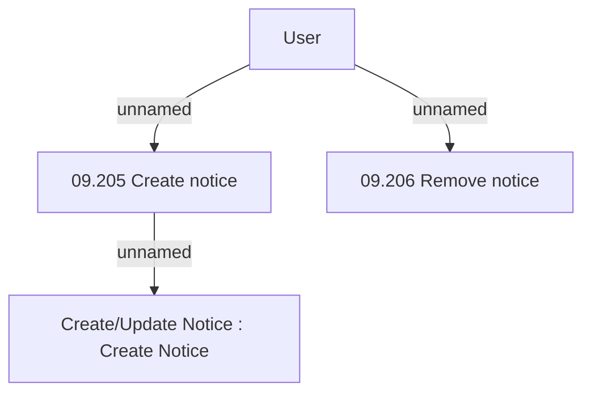

# Manage Notices

```mermaid
graph TD
    Create_Update_Notice_Create_Notice["Create/Update Notice : Create Notice"]
    n_09_205_Create_notice["09.205 Create notice"]
    n_09_206_Remove_notice["09.206 Remove notice"]
    User["User"]
    n_09_205_Create_notice -->|unnamed| Create_Update_Notice_Create_Notice
    User -->|unnamed| n_09_205_Create_notice
    User -->|unnamed| n_09_206_Remove_notice
```
