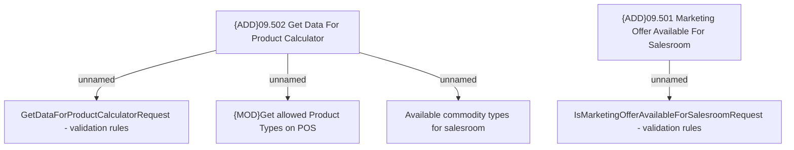

# Sales Features

```mermaid
graph TD
    GetDataForProductCalculatorRequest_validation_rules["GetDataForProductCalculatorRequest - validation rules"]
    MOD_Get_allowed_Product_Types_on_POS["{MOD}Get allowed Product Types on POS"]
    ADD_09_502_Get_Data_For_Product_Calculator["{ADD}09.502 Get Data For Product Calculator"]
    IsMarketingOfferAvailableForSalesroomRequest_validation_rule["IsMarketingOfferAvailableForSalesroomRequest - validation rules"]
    ADD_09_501_Marketing_Offer_Available_For_Salesroom["{ADD}09.501 Marketing Offer Available For Salesroom"]
    Available_commodity_types_for_salesroom["Available commodity types for salesroom"]
    ADD_09_502_Get_Data_For_Product_Calculator -->|unnamed| GetDataForProductCalculatorRequest_validation_rules
    ADD_09_502_Get_Data_For_Product_Calculator -->|unnamed| MOD_Get_allowed_Product_Types_on_POS
    ADD_09_501_Marketing_Offer_Available_For_Salesroom -->|unnamed| IsMarketingOfferAvailableForSalesroomRequest_validation_rule
    ADD_09_502_Get_Data_For_Product_Calculator -->|unnamed| Available_commodity_types_for_salesroom
```
