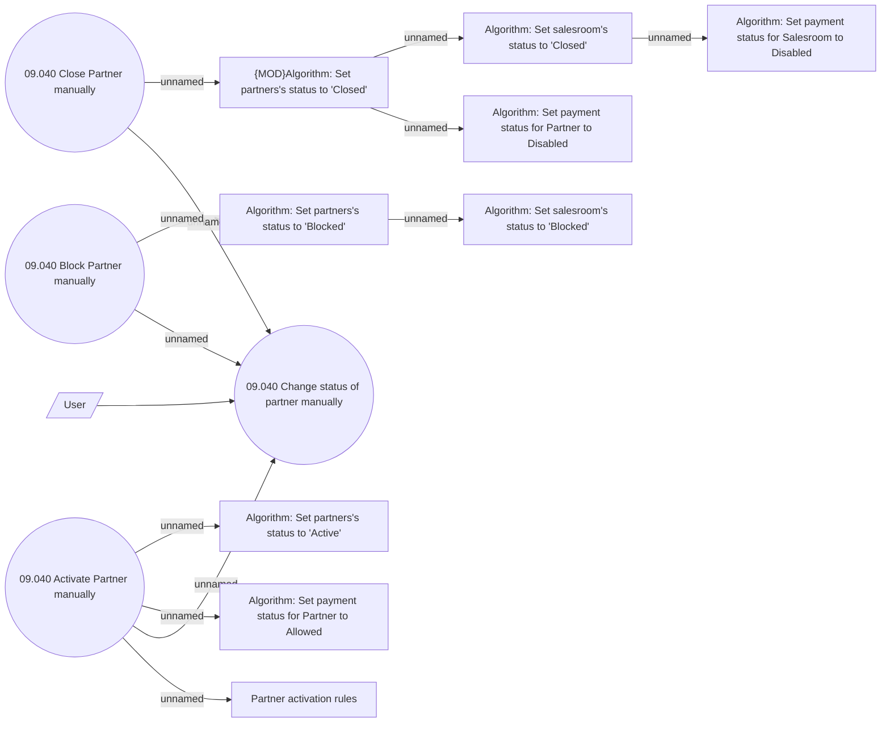

# Change Partner status

- **Diagram Type**: Use Case
- **Package**: HomerSelect/BSL/Analysis Model/Sales Network Management/Partner/COMMON for Partner/Use Case
- **Diagram ID**: 139392
- **Elements**: 14
- **Connectors**: 13

