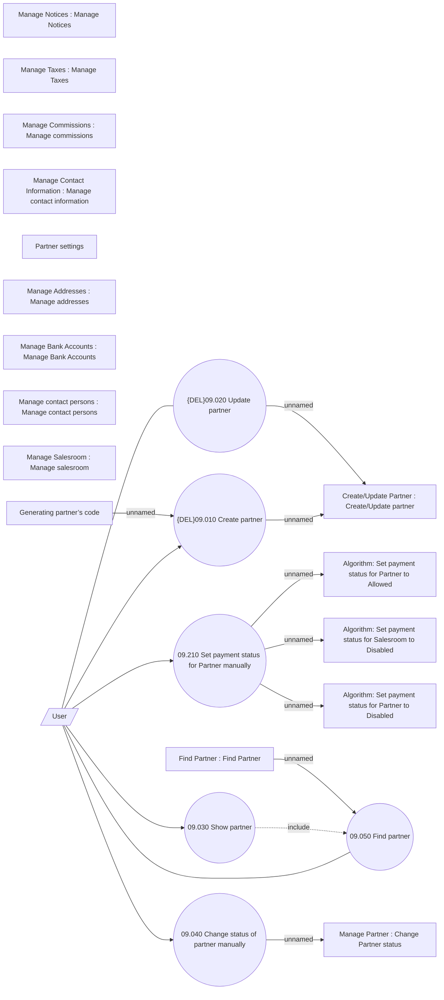

# Manage partner

- **Diagram Type**: Use Case
- **Package**: HomerSelect/BSL/Analysis Model/Sales Network Management/Partner/COMMON for Partner/Use Case
- **Diagram ID**: 139391
- **Elements**: 23
- **Connectors**: 15

