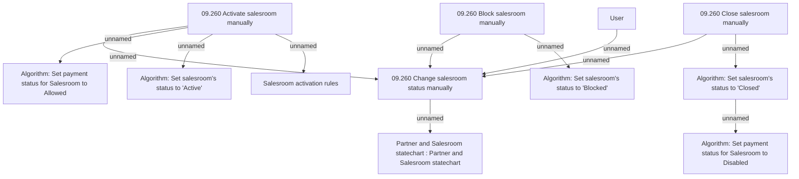

# Change Salesroom status

```mermaid
graph TD
    Salesroom_activation_rules["Salesroom activation rules"]
    Algorithm_Set_salesroom_s_status_to_Active["Algorithm: Set salesroom's status to 'Active'"]
    Algorithm_Set_salesroom_s_status_to_Closed["Algorithm: Set salesroom's status to 'Closed'"]
    Algorithm_Set_salesroom_s_status_to_Blocked["Algorithm: Set salesroom's status to 'Blocked'"]
    Algorithm_Set_payment_status_for_Salesroom_to_Allowed["Algorithm: Set payment status for Salesroom to Allowed"]
    Algorithm_Set_payment_status_for_Salesroom_to_Disabled["Algorithm: Set payment status for Salesroom to Disabled"]
    Partner_and_Salesroom_statechart_Partner_and_Salesroom_state["Partner and Salesroom statechart : Partner and Salesroom statechart"]
    n_09_260_Close_salesroom_manually["09.260 Close salesroom manually"]
    n_09_260_Block_salesroom_manually["09.260 Block salesroom manually"]
    n_09_260_Activate_salesroom_manually["09.260 Activate salesroom manually"]
    n_09_260_Change_salesroom_status_manually["09.260 Change salesroom status manually"]
    User["User"]
    n_09_260_Activate_salesroom_manually -->|unnamed| n_09_260_Change_salesroom_status_manually
    n_09_260_Block_salesroom_manually -->|unnamed| n_09_260_Change_salesroom_status_manually
    n_09_260_Close_salesroom_manually -->|unnamed| n_09_260_Change_salesroom_status_manually
    n_09_260_Change_salesroom_status_manually -->|unnamed| Partner_and_Salesroom_statechart_Partner_and_Salesroom_state
    n_09_260_Activate_salesroom_manually -->|unnamed| Algorithm_Set_payment_status_for_Salesroom_to_Allowed
    n_09_260_Block_salesroom_manually -->|unnamed| Algorithm_Set_salesroom_s_status_to_Blocked
    n_09_260_Close_salesroom_manually -->|unnamed| Algorithm_Set_salesroom_s_status_to_Closed
    n_09_260_Activate_salesroom_manually -->|unnamed| Algorithm_Set_salesroom_s_status_to_Active
    n_09_260_Activate_salesroom_manually -->|unnamed| Salesroom_activation_rules
    User -->|unnamed| n_09_260_Change_salesroom_status_manually
    Algorithm_Set_salesroom_s_status_to_Closed -->|unnamed| Algorithm_Set_payment_status_for_Salesroom_to_Disabled
```
