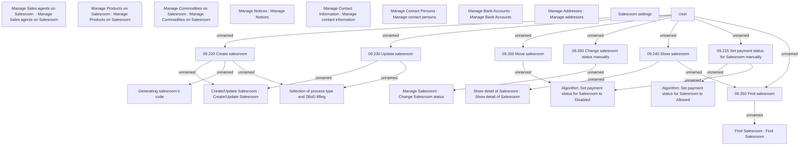

# Manage salesroom

```mermaid
graph TD
    Generating_salesroom_s_code["Generating salesroom’s code"]
    Algorithm_Set_payment_status_for_Salesroom_to_Allowed["Algorithm: Set payment status for Salesroom to Allowed"]
    Algorithm_Set_payment_status_for_Salesroom_to_Disabled["Algorithm: Set payment status for Salesroom to Disabled"]
    n_09_350_Move_salesroom["09.350 Move salesroom"]
    Manage_Sales_agents_on_Salesroom_Manage_Sales_agents_on_Sale["Manage Sales agents on Salesroom  : Manage Sales agents on Salesroom "]
    Manage_Products_on_Salesroom_Manage_Products_on_Salesroom["Manage Products on Salesroom : Manage Products on Salesroom"]
    Manage_Commodities_on_Salesroom_Manage_Commodities_on_Salesr["Manage Commodities on Salesroom : Manage Commodities on Salesroom"]
    Manage_Salesroom_Change_Salesroom_status["Manage Salesroom : Change Salesroom status"]
    Show_detail_of_Salesroom_Show_detail_of_Salesroom["Show detail of Salesroom : Show detail of Salesroom"]
    Create_Update_Salesroom_Create_Update_Salesroom["Create/Update Salesroom : Create/Update Salesroom"]
    Selection_of_process_type_and_2BoD_filling["Selection of process type and 2BoD filling"]
    Manage_Notices_Manage_Notices["Manage Notices : Manage Notices"]
    Manage_Contact_Information_Manage_contact_information["Manage Contact Information : Manage contact information"]
    Manage_Contact_Persons_Manage_contact_persons["Manage Contact Persons : Manage contact persons"]
    Manage_Bank_Accounts_Manage_Bank_Accounts["Manage Bank Accounts : Manage Bank Accounts"]
    Manage_Addresses_Manage_addresses["Manage Addresses : Manage addresses"]
    Salesroom_settings["Salesroom settings"]
    n_09_260_Change_salesroom_status_manually["09.260 Change salesroom status manually"]
    n_09_215_Set_payment_status_for_Salesroom_manually["09.215 Set payment status for Salesroom manually"]
    Find_Salesroom_Find_Salesroom["Find Salesroom : Find Salesroom"]
    n_09_250_Find_salesroom["09.250 Find salesroom"]
    n_09_240_Show_salesroom["09.240 Show salesroom"]
    n_09_230_Update_salesroom["09.230 Update salesroom"]
    n_09_220_Create_salesroom["09.220 Create salesroom"]
    User["User"]
    n_09_215_Set_payment_status_for_Salesroom_manually -->|unnamed| Algorithm_Set_payment_status_for_Salesroom_to_Allowed
    n_09_215_Set_payment_status_for_Salesroom_manually -->|unnamed| Algorithm_Set_payment_status_for_Salesroom_to_Disabled
    n_09_350_Move_salesroom -->|unnamed| Algorithm_Set_payment_status_for_Salesroom_to_Disabled
    n_09_260_Change_salesroom_status_manually -->|unnamed| Manage_Salesroom_Change_Salesroom_status
    n_09_240_Show_salesroom -->|unnamed| Show_detail_of_Salesroom_Show_detail_of_Salesroom
    n_09_220_Create_salesroom -->|unnamed| Create_Update_Salesroom_Create_Update_Salesroom
    n_09_230_Update_salesroom -->|unnamed| Create_Update_Salesroom_Create_Update_Salesroom
    n_09_220_Create_salesroom -->|unnamed| Generating_salesroom_s_code
    n_09_220_Create_salesroom -->|unnamed| Selection_of_process_type_and_2BoD_filling
    n_09_250_Find_salesroom -->|unnamed| Find_Salesroom_Find_Salesroom
    n_09_240_Show_salesroom -->|unnamed| n_09_250_Find_salesroom
    n_09_230_Update_salesroom -->|unnamed| Selection_of_process_type_and_2BoD_filling
    User -->|unnamed| n_09_220_Create_salesroom
    User -->|unnamed| n_09_230_Update_salesroom
    User -->|unnamed| n_09_350_Move_salesroom
    User -->|unnamed| n_09_260_Change_salesroom_status_manually
    User -->|unnamed| n_09_240_Show_salesroom
    User -->|unnamed| n_09_215_Set_payment_status_for_Salesroom_manually
    User -->|unnamed| n_09_250_Find_salesroom
```
