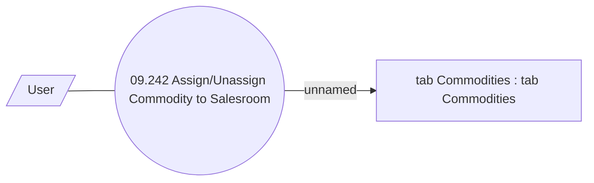

# Manage Commodities on Salesroom

- **Diagram Type**: Use Case
- **Package**: HomerSelect/BSL/Analysis Model/Sales Network Management/Salesroom/Commodities on Salesroom/Use Case
- **Diagram ID**: 39227
- **Elements**: 3
- **Connectors**: 2

