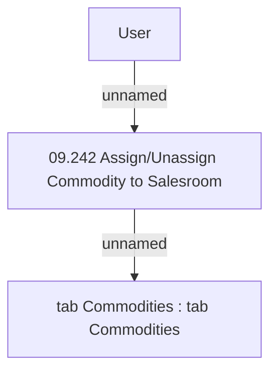

# Manage Commodities on Salesroom

```mermaid
graph TD
    tab_Commodities_tab_Commodities["tab Commodities : tab Commodities"]
    n_09_242_Assign_Unassign_Commodity_to_Salesroom["09.242 Assign/Unassign Commodity to Salesroom"]
    User["User"]
    n_09_242_Assign_Unassign_Commodity_to_Salesroom -->|unnamed| tab_Commodities_tab_Commodities
    User -->|unnamed| n_09_242_Assign_Unassign_Commodity_to_Salesroom
```
