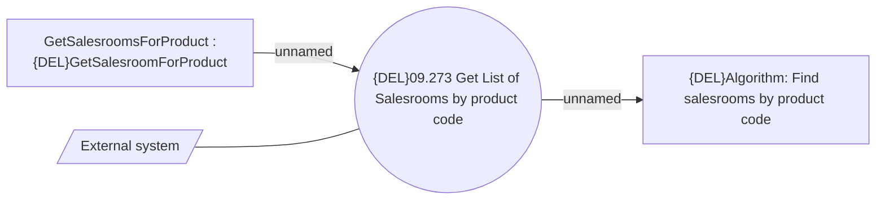

# Get List of Salesrooms by product code

- **Diagram Type**: Use Case
- **Package**: HomerSelect/BSL/Analysis Model/Sales Network Management/Salesroom/Products on Salesroom/Use Case
- **Diagram ID**: 150986
- **Elements**: 4
- **Connectors**: 3

