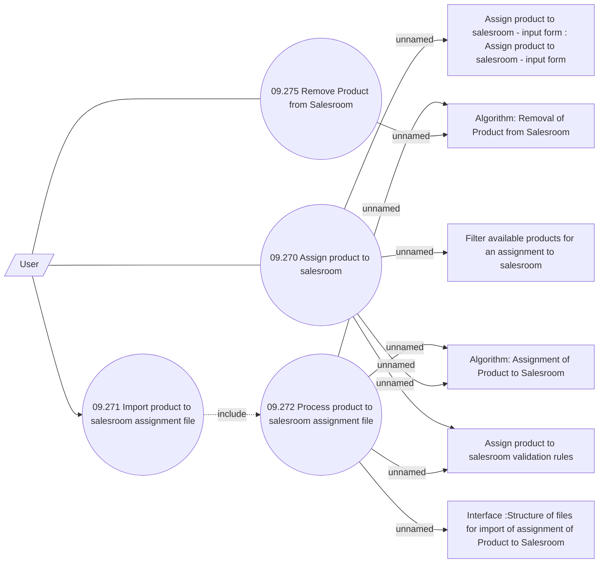

# Manage Products on Salesroom

- **Diagram Type**: Use Case
- **Package**: HomerSelect/BSL/Analysis Model/Sales Network Management/Salesroom/Products on Salesroom/Use Case
- **Diagram ID**: 150985
- **Elements**: 11
- **Connectors**: 13

