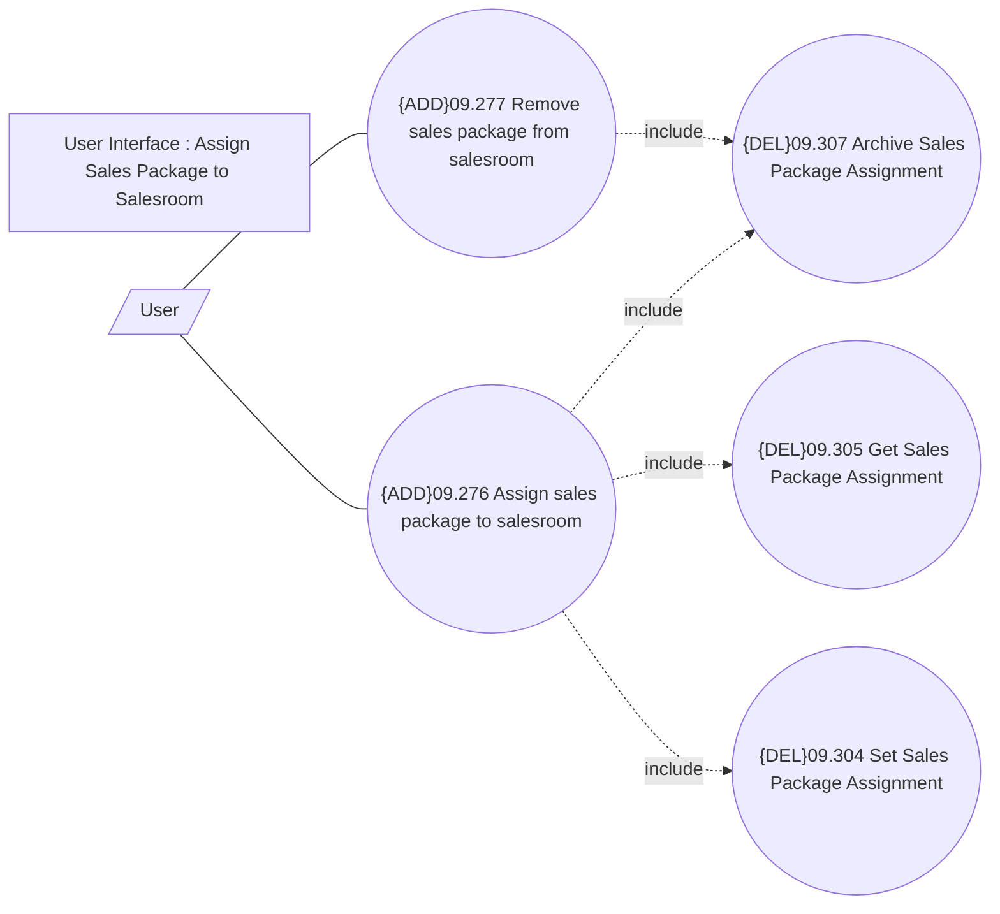

# Manage Sales Packages on Salesroom

- **Diagram Type**: Use Case
- **Package**: HomerSelect/BSL/Analysis Model/Sales Network Management/Salesroom/Sales Packages on Salesroom/Use Case
- **Diagram ID**: 103770
- **Elements**: 7
- **Connectors**: 6

