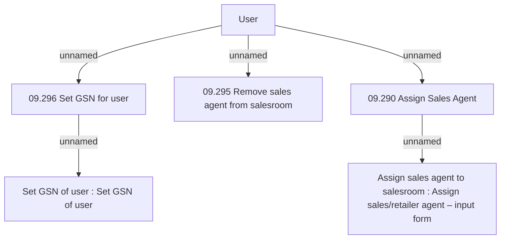

# Manage Sales agents on Salesroom 

```mermaid
graph TD
    Set_GSN_of_user_Set_GSN_of_user["Set GSN of user : Set GSN of user"]
    n_09_296_Set_GSN_for_user["09.296 Set GSN for user"]
    Assign_sales_agent_to_salesroom_Assign_sales_retailer_agent_["Assign sales agent to salesroom : Assign sales/retailer agent – input form"]
    User["User"]
    n_09_295_Remove_sales_agent_from_salesroom["09.295 Remove sales agent from salesroom"]
    n_09_290_Assign_Sales_Agent["09.290 Assign Sales Agent"]
    n_09_290_Assign_Sales_Agent -->|unnamed| Assign_sales_agent_to_salesroom_Assign_sales_retailer_agent_
    n_09_296_Set_GSN_for_user -->|unnamed| Set_GSN_of_user_Set_GSN_of_user
    User -->|unnamed| n_09_295_Remove_sales_agent_from_salesroom
    User -->|unnamed| n_09_296_Set_GSN_for_user
    User -->|unnamed| n_09_290_Assign_Sales_Agent
```
