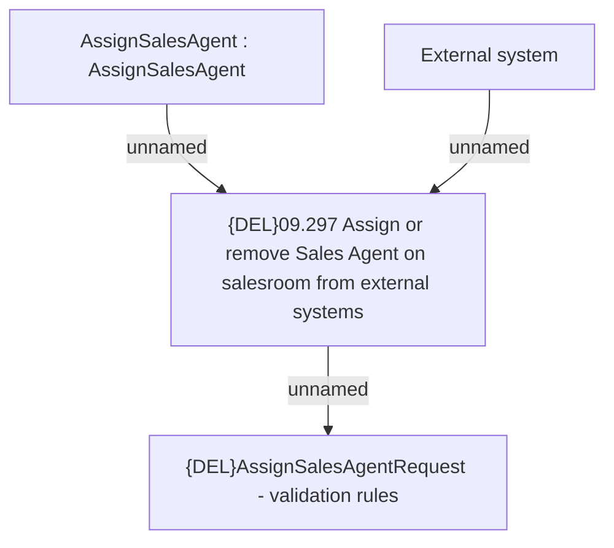

# {DEL}Manage Sales agents on Salesroom from external systems

```mermaid
graph TD
    DEL_AssignSalesAgentRequest_validation_rules["{DEL}AssignSalesAgentRequest - validation rules"]
    AssignSalesAgent_AssignSalesAgent["AssignSalesAgent : AssignSalesAgent"]
    External_system["External system"]
    DEL_09_297_Assign_or_remove_Sales_Agent_on_salesroom_from_ex["{DEL}09.297 Assign or remove Sales Agent on salesroom from external systems"]
    AssignSalesAgent_AssignSalesAgent -->|unnamed| DEL_09_297_Assign_or_remove_Sales_Agent_on_salesroom_from_ex
    DEL_09_297_Assign_or_remove_Sales_Agent_on_salesroom_from_ex -->|unnamed| DEL_AssignSalesAgentRequest_validation_rules
    External_system -->|unnamed| DEL_09_297_Assign_or_remove_Sales_Agent_on_salesroom_from_ex
```
