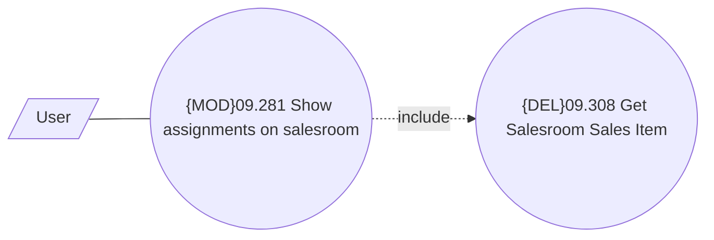

# Salesroom Assignment UC

- **Diagram Type**: Use Case
- **Package**: HomerSelect/BSL/Analysis Model/Sales Network Management/Salesroom/Salesroom Assignment View/Use Case
- **Diagram ID**: 102652
- **Elements**: 3
- **Connectors**: 2

