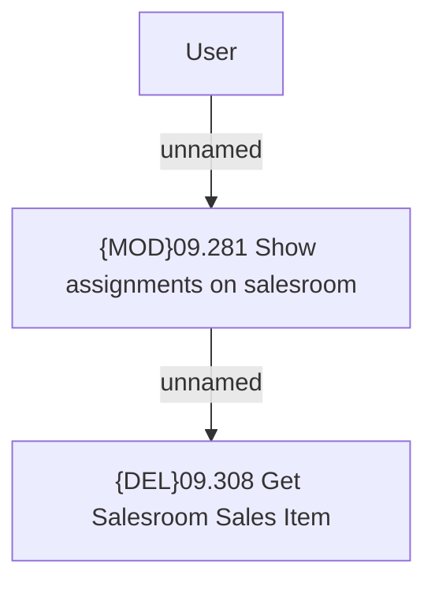

# Salesroom Assignment UC

```mermaid
graph TD
    User["User"]
    MOD_09_281_Show_assignments_on_salesroom["{MOD}09.281 Show assignments on salesroom"]
    DEL_09_308_Get_Salesroom_Sales_Item["{DEL}09.308 Get Salesroom Sales Item"]
    User -->|unnamed| MOD_09_281_Show_assignments_on_salesroom
    MOD_09_281_Show_assignments_on_salesroom -->|unnamed| DEL_09_308_Get_Salesroom_Sales_Item
```
