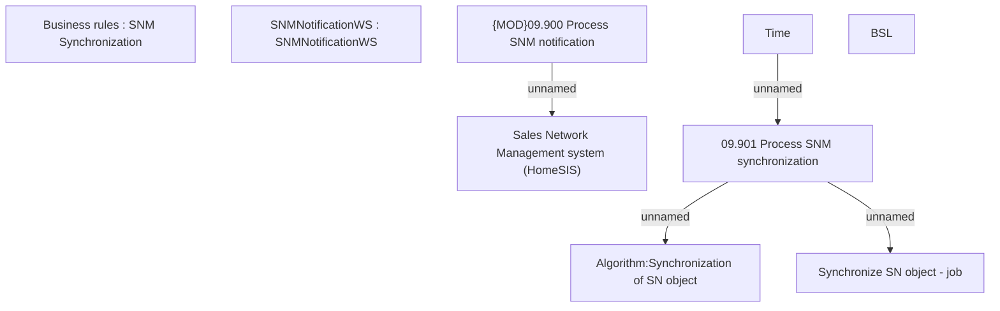

# Synchronization of SNM data

```mermaid
graph TD
    Business_rules_SNM_Synchronization["Business rules : SNM Synchronization"]
    Synchronize_SN_object_job["Synchronize SN object - job"]
    SNMNotificationWS_SNMNotificationWS["SNMNotificationWS : SNMNotificationWS"]
    Time["Time"]
    Algorithm_Synchronization_of_SN_object["Algorithm:Synchronization of SN object"]
    MOD_09_900_Process_SNM_notification["{MOD}09.900 Process SNM notification"]
    BSL["BSL"]
    Sales_Network_Management_system_HomeSIS["Sales Network Management system (HomeSIS)"]
    n_09_901_Process_SNM_synchronization["09.901 Process SNM synchronization"]
    MOD_09_900_Process_SNM_notification -->|unnamed| Sales_Network_Management_system_HomeSIS
    n_09_901_Process_SNM_synchronization -->|unnamed| Algorithm_Synchronization_of_SN_object
    n_09_901_Process_SNM_synchronization -->|unnamed| Synchronize_SN_object_job
    Time -->|unnamed| n_09_901_Process_SNM_synchronization
```
